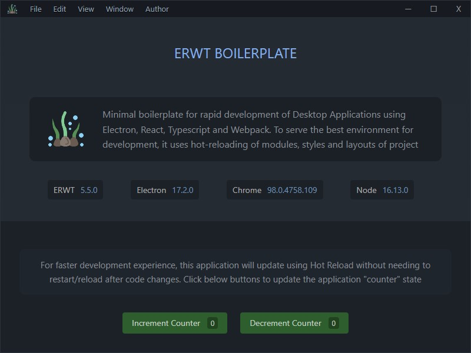

# Electron React Webpack Typescript - Boilerplate 2022

ERWT is a minimal boilerplate for writing Desktop Applications using [Electron](https://www.electronjs.org/), [React](https://reactjs.org/), [Webpack](https://webpack.js.org/) & [TypeScript](https://www.typescriptlang.org/). <br /> This project makes use of latest packages and configurations to serve the best environment for development.

## Screenshot



<br>

## Custom Window Titlebar & Menu

This project now includes custom [Electron Window](https://github.com/guasam/electron-window), Titlebar, Menu Items, Window Controls & application icon etc by default. Menu items and windows controls layout or colors can be customized easily by modifying the `misc/window` modules. The `windows` platform buttons are being used by default in the Titlebar.

Menubar can be toggled by pressing `ALT` key

<center>
    
</center>

<br>

## Core Features

- 📐 Custom Window & Titlebar with Menus
- 🌟 Electron
- 🌀 TypeScript
- ⚛️ React
- 🛶 LESS Loader
- 🎨 CSS Loader
- 📸 Image Loader
- 🆎 Font Loader
- 🧹 ESLint
- 📦 Electron Forge
- 🔱 Webpack & Configuration
- 🧩 Aliases for project paths
- 🔥 Hot Module Replacement (Live Reload)
- 🎁 Package Bundling (Distribution / Release)

<br />

## Installation

To clone the ERWT boilerplate, you need to run following commands:


Master version of ERWT contains project files in separate context for main and renderer process, uses custom window, custom titlebar & menus.

```bash
git clone --recurse-submodules https://github.com/codesbiome/electron-react-webpack-typescript-2022
```

<div align="center">
    OR
</div>


Minimal version of ERWT contains very simple project files structure, no custom window, no custom titlebar & menus.

```bash
git clone -b minimal https://github.com/codesbiome/electron-react-webpack-typescript-2022
```

<br>

Install dependencies using [Yarn](https://www.npmjs.com/package/yarn) or [NPM](https://www.npmjs.com/) :

```bash
yarn install
```

<br />

## Start : Development

To develop and run your application, you need to run following command.
<br />
Start electron application for development :

```bash
yarn start
```

<br />

## Lint : Development

To lint application source code using ESLint via this command :

```bash
yarn lint
```

<br />

## Package : Production

Customize and package your Electron app with OS-specific bundles (.app, .exe etc)

```bash
yarn package
```

<br />

## Make : Production

Making is a way of taking your packaged application and making platform specific distributables like DMG, EXE, or Flatpak files (amongst others).

```bash
yarn make
```

<br />

## Publish : Production

Publishing is a way of taking the artifacts generated by the `make` command and sending them to a service somewhere for you to distribute or use as updates. (This could be your update server or an S3 bucket)

```bash
yarn publish
```

<br />

## Packager & Makers Configuration

This provides an easy way of configuring your packaged application and making platform specific distributables like DMG, EXE, or Flatpak files.

This configurations file is available in :

```bash
tools/forge/forge.config.js
```

For further information, you can visit [Electron Forge Configuration](https://www.electronforge.io/configuration)
